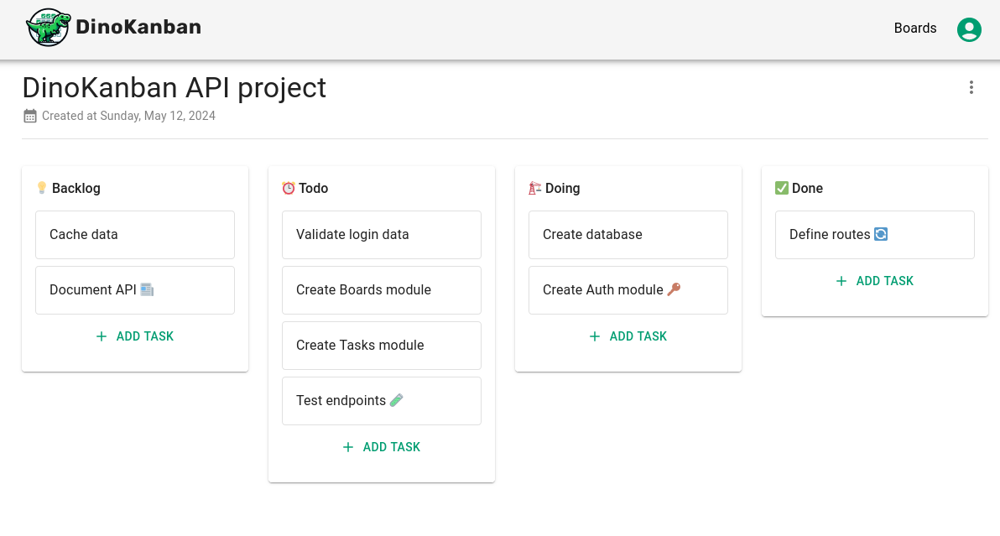

# DinoKanban App 🦖

Aplicación Web para la gestión de tareas con tableros kanban.

Esta aplicación es el frontend del proyecto fullstack Dinokanban, donde también se incluye una [API REST](https://github.com/JSamuelAP/DinoKanban-API).

Entre las características de Dinokanban App:

- Registro y autenticación de usuarios
- Creación, edición y eliminación de tableros
- Guardar tableros como favoritos
- Creación, edición y eliminación de tareas
- Arrastrar y soltar tareas, con persisencia

## Enlaces 🔗

- Web app: [Github pages](https://jsamuelap.github.io/DinoKanban-APP/)
- Repositorio: [Github](https://github.com/JSamuelAP/DinoKanban-APP)
- Respositorio de la API: [Github](https://github.com/JSamuelAP/DinoKanban-API)
- Documentación de la API: [Postman](https://documenter.getpostman.com/view/27778436/2s9Ykq7LXn)

## Tecnologías 🧰

- [React](https://reactjs.org/) - Librería UI de javascript
  - [React beautiful Dnd](https://www.npmjs.com/package/react-beautiful-dnd) - Librería para las interacciones de arrastar y soltar
  - [React Router](https://reactrouter.com/en/main) - Enrutador para React
  - [React Query](https://tanstack.com/query/v3) - Librería para el manejo del estado asíncrono
    - [Axios](https://axios-http.com/) - Cliente HTTP
  - [React Hook Form](https://react-hook-form.com/) - Librería para la validación de formularios
  - [Zustand](https://zustand-demo.pmnd.rs/) - Librería para el manejo del estado global
  - [Material UI](https://mui.com/) - Framework de componentes para React
- [Vite](https://main.vitejs.dev/) - Herramienta de compilación

## Qué aprendí 🧠

### Autenticación

La autenticación únicamente con un token de acceso es insegura porque el cliente lo almacena y puede ser accedido por cualquiera. Por lo tanto, implementé una estrategia más segura utilizando tokens de acceso y de refresco. El token de acceso se guarda solo en la memoria del programa, mientras que el token de refresco se almacena en cookies seguras, evitando el acceso directo del cliente. Esta doble autenticación asegura que ambos tokens sean necesarios y que la seguridad no se vea comprometida si uno de ellos se filtra. Aunque es una solución más segura, sigue teniendo algunas vulnerabilidades, y su implementación manual en la API resultó complicada. Esto me motiva a aprender en el futuro métodos más robustos y librerías que simplifiquen la autenticación.

### Testing

Utilicé Postman extensivamente no solo para probar y documentar los endpoints de mi API, sino también para automatizar el proceso de pruebas. Sus herramientas de programación y testeo me permitieron ejecutar secuencialmente todas las pruebas con un solo clic y obtener resultados rápidamente. Esta herramienta fue fundamental para optimizar y automatizar mis pruebas.

### Drag and Drop

El mayor desafío en este proyecto fue implementar la funcionalidad de arrastrar y soltar tareas. Por un lado, desarrollé un algoritmo para actualizar y guardar la posición de las tareas con cada movimiento. Por otro lado, optimicé el frontend para reaccionar rápidamente a las llamadas a la API, utilizando actualizaciones optimistas para reflejar los cambios antes de recibir la respuesta del servidor.

### Node.js y React

Estoy orgulloso del trabajo realizado. Los problemas técnicos y las pausas obligadas por mis estudios me hicieron reconsiderar abandonar el proyecto y optar por algo más sencillo. Sin embargo, superé esos momentos de duda con determinación y completé el proyecto. La experiencia adquirida con Node.js y React me reveló la complejidad de trabajar con estas tecnologías en proyectos medianos, y más aún en proyectos grandes, debido a la flexibilidad y la integración de librerías externas. Esto me ha llevado a decidir que mi próximo paso es aprender frameworks que faciliten el desarrollo y mantenimiento de proyectos, como NestJS para APIs y Next.js o Angular para aplicaciones frontend.

## Autor ✒️

- Website - [JSamuel](https://jsamuelap.github.io)
- Github - [@JSamuelAP](https://github.com/JSamuelAP)
- Frontend Mentor - [@JSamuelAP](https://www.frontendmentor.io/profile/JSamuelAP)
- LinkedIn - [@JSamuelAP](https://www.linkedin.com/in/jsamuelap)
- Twitter - [@JSamuelAP](https://www.twitter.com/yourusername)
- Email - [sp4619168@gmail.com](mailto:sp4619168@gmail.com)
